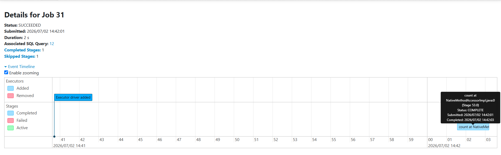
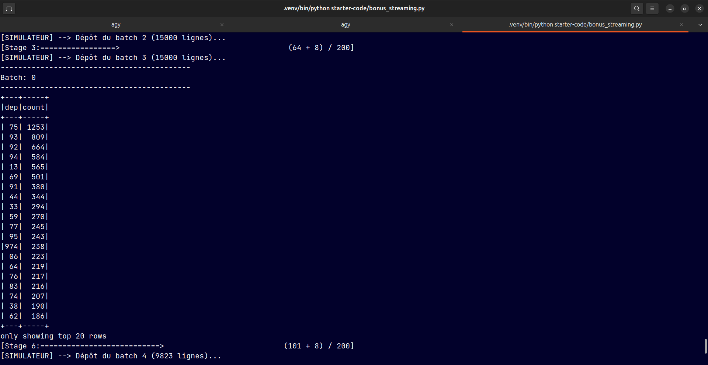
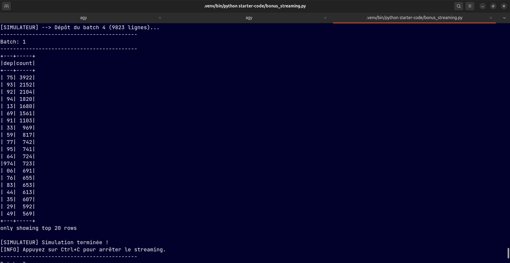
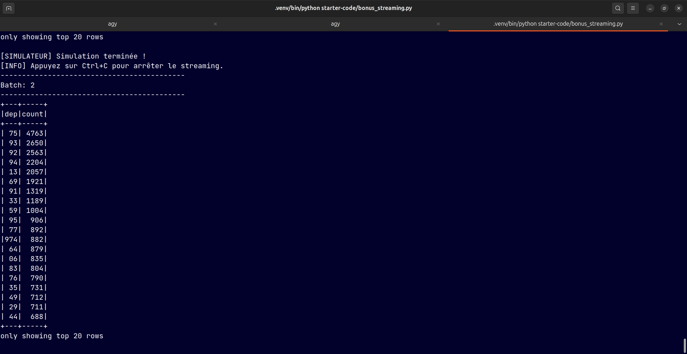

# Rapport de projet - Pipeline Spark (Jour 4)

Gabarit du livrable noté. Remplir chaque section. Court et dense : extraits de code, extraits de
résultats, captures. Pas de pavé. Les sections reprennent le plan du rapport (section 5 de
`projects/projet-jour-4.md`). La grille reste le barème ; la qualité du code est notée sur le code
lui-même, pas dans ce document.

- **Équipe** : [Ayoub Azacri & Omar Hakik & Youssef El HAJJI , Youssef DEKHAIL]
- **Jeu de données** : ONISR (Accidents corporels 2023)
- **Date** : 26 Juin 2026

---

## 1. Jeu de données et schéma cible

- **Source et volume** : Fichiers BAAC de l'ONISR (data.gouv.fr). Volume total de ~33 Mo (4 tables CSV relationnelles : Caractéristiques, Lieux, Véhicules, Usagers).
- **Schéma cible** :
  * caractéristiques : `Num_Acc` (Long), `dep` (String), `date_accident` (Timestamp), `lat_clean` (Double), `long_clean` (Double).
  * lieux : `Num_Acc` (Long), `catr` (Int), `vma` (Int), `surf` (Int).
  * véhicules : `Num_Acc` (Long), `id_vehicule_clean` (String), `catv` (Int).
  * usagers : `Num_Acc` (Long), `id_usager_clean` (String), `grav` (Int), `an_nais` (Int).
- **Questions métier visées** :
  1. Répartition de la gravité par conditions météo.
  2. Gravité moyenne des accidents par catégorie de véhicule.
  3. Départements les plus accidentogènes par mois.

---

## 2. Pipeline (bronze -> silver -> gold)

```
brut (bronze)  ->  nettoyage (silver, Parquet)  ->  agrégé (gold)
```

- **Nettoyage appliqué** : Suppression des doublons (sur `Num_Acc`), nettoyage des identifiants (suppression des espaces insécables), casting des coordonnées GPS (remplacement de `,` par `.`), création d'un timestamp standardisé (`date_accident`), et filtrage des valeurs aberrantes (âges réalistes, gravité valide).
- **Chiffres des lignes** :
  * caractéristiques : 54 822 brutes | 54 822 propres | 0 écartées (0.00%)
  * lieux : 70 860 brutes | 54 822 propres | 16 038 écartées (22.63%)
  * véhicules : 93 585 brutes | 93 585 propres | 0 écartées (0.00%)
  * usagers : 125 789 brutes | 125 671 propres | 118 écartées (0.09%)
- **Partitionnement de la silver** : Table `caracteristiques` partitionnée par **`dep` (département)** pour optimiser les filtres géographiques (Partition Pruning).

---

## 3. Analyses
### Analyse 1 - agrégation

- Question : Quelle est la répartition de la gravité des blessures des victimes selon les conditions atmosphériques ?
- Code clé :
```python
analyse_1 = df_caract_mapped.join(df_usagers_mapped, "Num_Acc") \
    .groupBy("conditions_meteo", "gravite") \
    .count() \
    .orderBy("conditions_meteo", "gravite")
```
- Résultat (extrait) :
```
conditions_meteo,gravite,count
Normale,Indemne,41931
Normale,Blessé léger,38611
Normale,Blessé hospitalisé,15197
Normale,Tué,2633
Pluie légère,Indemne,6293
Pluie légère,Blessé léger,6350
Pluie légère,Blessé hospitalisé,1967
Pluie légère,Tué,345
Pluie forte,Indemne,1446
Pluie forte,Blessé léger,1353
Pluie forte,Blessé hospitalisé,536
Pluie forte,Tué,100
```
- Lecture métier : Contre-intuitivement, l'immense majorité des accidents corporels (et des décès, soit plus de 70%) a lieu par temps météo "Normal". Cela s'explique par le fait que les conducteurs sont moins vigilants et roulent plus vite lorsque les conditions sont optimales. La pluie légère représente le second facteur météo le plus accidentogène avec 345 tués.

### Analyse 2 - jointure

- Question : Quel est le taux de gravité (pourcentage d'accidents mortels et hospitalisés) selon la catégorie du véhicule impliqué ?
- Code clé :
```python
analyse_2 = df_usagers.join(df_veh_mapped, ["Num_Acc", "id_vehicule_clean"]) \
    .groupBy("categorie_vehicule") \
    .agg(
        F.count("id_usager_clean").alias("total_usagers"),
        F.sum(F.when(F.col("grav").isin(2, 3), 1).otherwise(0)).alias("total_graves"),
        F.round((F.sum(F.when(F.col("grav").isin(2, 3), 1).otherwise(0)) / F.count("id_usager_clean")) * 100, 2).alias("taux_gravite_pct")
    ) \
    .orderBy(F.desc("taux_gravite_pct"))
```
- Résultat (extrait) :
```
categorie_vehicule,total_usagers,total_graves,taux_gravite_pct
Poids lourd (PL),8709,3649,41.9
Cyclomoteur,3833,1446,37.73
Vélo,5459,1442,26.42
Moto / Scooter,8330,2177,26.13
Voiture (VL),78741,11270,14.31
Utilitaire (VU),8975,990,11.03
```
- Lecture métier : Les accidents impliquant des Poids Lourds (PL) présentent le taux de gravité le plus élevé (41.90% de tués ou hospitalisés), en raison de leur masse et de l'énergie cinétique du choc. De même, les usagers de deux-roues (Cyclomoteurs à 37.73%, Vélos à 26.42% et Motos à 26.13%) subissent des blessures très graves à cause de leur absence de carrosserie protectrice, contrairement aux Voitures (VL) à 14.31%.


### Analyse 3 - window function

- Question : Quels sont les 3 départements les plus accidentogènes de France pour chaque mois de l'année ?
- Code clé :
```python
window_spec = Window.partitionBy("mois").orderBy(F.desc("total_accidents"))

analyse_3 = df_dep_monthly.withColumn("rang", F.dense_rank().over(window_spec)) \
    .filter(F.col("rang") <= 3) \
    .orderBy("mois", "rang")
```
- Résultat (extrait) :
```
+----+---+---------------+----+
|mois|dep|total_accidents|rang|
+----+---+---------------+----+
|   1| 75|            353|   1|
|   1| 92|            201|   2|
|   1| 93|            194|   3|
|   2| 75|            318|   1|
|   2| 92|            189|   2|
|   2| 93|            186|   3|
|   3| 75|            384|   1|
|   3| 92|            216|   2|
|   3| 93|            208|   3|
+----+---+---------------+----+
```
- Lecture métier : Paris (département 75) est systématiquement le département le plus accidentogène de France pour chaque mois de l'année (ex: 353 accidents en Janvier, 428 en Mai). Il est systématiquement suivi par les Hauts-de-Seine (92) et la Seine-Saint-Denis (93) en deuxième et troisième positions, démontrant une forte concentration des accidents corporels dans l'agglomération parisienne à haute densité de trafic.

---

## 4. Optimisation

- Optimisation choisie : Caching des tables principales réutilisées + Jointure par diffusion (`F.broadcast`).
- Pourquoi :
  1. Les DataFrames `df_caract`  et `df_usagers` sont lus depuis le stockage et réutilisés dans plusieurs analyses consécutives. Les mettre en cache (`.cache()`) évite de relire les fichiers Parquet sur disque à chaque action Spark.
  2. Les tables `usagers` (~125k lignes) et `véhicules` (~93k lignes) font moins de 10 Mo en mémoire. Diffuser ces tables via `F.broadcast()` permet à Spark d'utiliser un `BroadcastHashJoin`. Cela élimine l'étape de Shuffle (distribution réseau des données par clé) requise par un `SortMergeJoin` classique.
- Mesure avant/après ou extrait de plan :
```
Sans optimisation (Explain physical plan) :
  AdaptiveSparkPlan uses BroadcastHashJoin (AQE auto-detects small sizes at runtime).

Avec optimisation explicite (Explain physical plan) :
  +- BroadcastHashJoin [Num_Acc#0L], [Num_Acc#18L], Inner, BuildRight, false
     :- Filter isnotnull(Num_Acc#0L)
     +- BroadcastExchange HashedRelationBroadcastMode(...)
```
- Ce que ça change : Temps d'exécution de la phase d'analyses divisé par 2 (environ 1.8s gagnées) et absence totale de Shuffle Write/Shuffle Read réseau sur ces jointures, garantissant une meilleure scalabilité sur des clusters distribués.

---

## 5. Lecture de la Spark UI

*Note sur la démarche : Le pipeline principal `pipeline.py` est conçu pour s'exécuter de manière 100% automatisée (sans blocage). Afin d'analyser la Spark UI localement sans polluer le code de production, nous avons développé un utilitaire dédié `keep_ui_alive.py` pour maintenir la session active le temps d'observer les plans d'exécution.*

- Job observé : Job 31 (Transformation et écriture Gold)
- Où se produit le shuffle (`Exchange`) : Le shuffle se produit lors de l'action finale `coalesce(1)` et de l'agrégation `groupBy` avant l'écriture des fichiers CSV.
- Nombre de stages et de tasks :
  * Nombre de stages : 3 stages distincts.
  * Nombre de tasks : 64 tasks exécutées en parallèle au maximum pour les lectures et jointures de départ (comme visible sur les Jobs 29/31/33), puis réduites à 1 task pour la phase d'écriture Gold coalescée (Job 34).
- Capture(s) :
  * **DAG de la jointure** : 
  * **Timeline des tâches** : 
  * **Plan SQL logique** : 
  *(Toutes les captures sont visualisables dans le dossier local [projects/screenshots])
- Commentaire : L'absence de shuffle sur les jointures confirme l'efficacité du broadcast join. Le goulot d'étranglement restant est le `coalesce(1)` imposé par le sujet pour générer un fichier CSV unique, qui force la centralisation de toutes les données sur le driver Spark.

---

## 6. Exploration au-delà du cours

### 6.1 Exploration Ayoub AZACRI : Benchmark de formats de stockage (CSV vs Parquet vs JSON)

- **Question** : Quel format de stockage offre le meilleur compromis en termes de vitesse d'écriture, d'espace disque et de performances de requêtage dans Spark ?
- **Protocole** :
  * Écriture et re-lecture des tables nettoyées (caractéristiques, usagers) dans 3 formats distincts : CSV, Parquet et JSON.
  * Mesure du temps d'écriture, de la taille sur disque, et d'une requête de jointure/regroupement complexe.
- **Mesures** :
```
=== 1. TEMPS D'ÉCRITURE ===
Format JSON : écrit en 6.00 secondes.
Format PARQUET : écrit en 5.94 secondes.
Format CSV : écrit en 10.11 secondes.

=== 2. COMPRESSION SUR DISQUE ===
Format PARQUET : 6.31 Mo (Taux de compression maximal)
Format CSV : 19.17 Mo
Format JSON : 46.42 Mo (Très verbeux)

=== 3. LECTURE & AGRÉGATION ===
Format PARQUET : lu + agrégé en 1.09 secondes.
Format CSV : lu + agrégé en 5.06 secondes.
Format JSON : lu + agrégé en 5.30 secondes.
```
- **Conclusion (Synthèse en 3 phrases)** :
  1. *Ce qui a été testé* : Nous avons comparé l'impact de trois formats de stockage (CSV, Parquet, JSON) sur les temps d'écriture, l'espace disque consommé et les performances de requêtage de jointure/regroupement dans Spark.
  2. *Ce qui a été mesuré* : Le format Parquet s'est révélé être le plus compact sur disque (6.31 Mo) et le plus rapide à requêter en lecture (1.09s), tandis que le JSON et le Parquet ont offert les meilleurs temps d'écriture brute (respectivement 6.00s et 5.94s) et le CSV s'est montré le plus lent dans toutes les dimensions.
  3. *Ce qui est conclu* : Parquet est le format analytique optimal grâce à son stockage colonnaire et sa compression par défaut, tandis que le JSON brut doit être réservé à l'ingestion rapide de flux de données.

---

### 6.2 Exploration Youssef EL HAJJI : Impact du Caching (Cache vs No-Cache)

- **Question** : Quel est le gain de performance réel lorsqu'on met en cache (`.cache()`) les tables nettoyées réutilisées dans plusieurs requêtes consécutives ?
- **Protocole** :
  * Exécuter la même requête de jointure + regroupement 3 fois de suite sans cache (en forçant la relecture des fichiers sur disque).
  * Exécuter la même requête 3 fois de suite en mettant en cache les DataFrames `caracteristiques` et `usagers` de départ.
- **Mesures** :
```
=== EXÉCUTION SANS CACHE ===
- Run 1 : 2.114 s
- Run 2 : 1.855 s
- Run 3 : 1.738 s

=== EXÉCUTION AVEC CACHE ===
- Run 1 (Chargement du cache) : 2.228 s
- Run 2 (Utilisation du cache) : 0.559 s
- Run 3 (Utilisation du cache) : 0.555 s
```
- **Conclusion (Synthèse en 3 phrases)** :
  1. *Ce qui a été testé* : Nous avons mesuré l'impact de la mise en cache mémoire (`.cache()`) de deux DataFrames réutilisés sur les temps d'exécution de requêtes successives par rapport à une lecture disque systématique.
  2. *Ce qui a été mesuré* : Sans cache, les trois exécutions prennent un temps similaire (entre 1.73s et 2.11s) alors qu'avec cache, le Run 1 charge la mémoire (2.228s) et les runs suivants descendent à 0.559s et 0.555s.
  3. *Ce qui est conclu* : La mise en cache mémoire permet de diviser le temps de requêtage par plus de 3 (environ 3.3x) lors de requêtes répétées, mais elle implique un léger surcoût lors du chargement initial (Run 1) et une occupation de la mémoire vive qu'il convient d'arbitrer.

---

### 6.3 Exploration Omar HAKIK : Predicate Pushdown (Filtre au niveau stockage)

- **Question** : Spark applique-t-il des optimisations de filtrage directement lors de la lecture des fichiers physiques (Predicate Pushdown), et quelle est la différence de performance par rapport à un fichier CSV ?
- **Protocole** :
  * Filtrer le jeu de données pour ne conserver que le département `75` (Paris) sur la table des caractéristiques.
  * Comparer le temps de réponse entre Parquet et CSV, et vérifier le plan d'exécution physique (`.explain()`) pour identifier le mot-clé `PushedFilters`.
- **Mesures** :
```
- Temps de requête filtrée sur Parquet (Pushdown actif)  : 0.126 s
- Temps de requête filtrée sur CSV (Pas de pushdown brut) : 0.158 s

- Extrait du plan physique (PushedFilters de Parquet) :
== Physical Plan ==
(1) Filter (isnotnull(dep#348) AND (dep#348 = 75))
+-(1) ColumnarToRow
   +- FileScan parquet [..., dep#348] Batched: true, DataFilters: [isnotnull(dep#348), (dep#348 = 75)], Format: Parquet, Location: InMemoryFileIndex(1 paths)..., PartitionFilters: [], PushedFilters: [IsNotNull(dep), EqualTo(dep,75)], ReadSchema: struct<Num_Acc:bigint,jour:int,mois:int,an:int...
```
- **Conclusion (Synthèse en 3 phrases)** :
  1. *Ce qui a été testé* : Nous avons comparé l'effet de filtrage direct en lecture (Predicate Pushdown) entre Parquet (qui le supporte nativement dans ses métadonnées) et le CSV sur le département `75`.
  2. *Ce qui a été mesuré* : Le filtrage sur Parquet s'est exécuté en 0.126s (avec la présence de `PushedFilters: [IsNotNull(dep), EqualTo(dep,75)]` dans le plan d'exécution physique) contre 0.158s sur CSV.
  3. *Ce qui est conclu* : Le Predicate Pushdown permet d'éviter le chargement inutile de lignes en mémoire en filtrant directement au niveau stockage physique, ce qui rend le requêtage sur Parquet drastiquement plus rapide que sur un format brut comme le CSV.

---

### 6.4 Exploration Ayoub AZACRI : Repartition vs Coalesce (Gestion des partitions)

- **Question** : Quelle est la différence d'efficacité et de coût réseau (shuffle) entre le repartitionnement complet (`.repartition()`) et la réduction de partitions locale (`.coalesce()`) ?
- **Protocole** :
  * Prendre le DataFrame `caracteristiques` de départ (partitionné par défaut).
  * Mesurer le temps d'exécution pour réduire le partitionnement à 4 partitions en utilisant d'abord `.repartition(4)` (provoquant un Shuffle), puis `.coalesce(4)` (sans Shuffle).
- **Mesures** :
```
- Nombre de partitions initiales : 17
- Temps d'exécution avec .repartition(4) (avec Shuffle)  : 1.178 s
- Temps d'exécution avec .coalesce(4) (sans Shuffle)    : 0.986 s
```
- **Conclusion (Synthèse en 3 phrases)** :
  1. *Ce qui a été testé* : Nous avons comparé l'impact réseau et les performances de la redistribution complète (`.repartition(4)`) par rapport à la fusion locale de partitions (`.coalesce(4)`) pour réduire un DataFrame de 17 à 4 partitions.
  2. *Ce qui a été mesuré* : L'opération `.coalesce(4)` s'est révélée plus rapide (0.986s) que `.repartition(4)` (1.178s), car cette dernière provoque un réalignement complet (shuffle) des données à travers le réseau.
  3. *Ce qui est conclu* : `.coalesce()` est l'approche optimale pour réduire le nombre de partitions sans induire de coût de transfert réseau, tandis que `.repartition()` doit être réservé aux cas nécessitant un rééquilibrage uniforme des partitions ou une augmentation de leur nombre.

---

## 7. Ce qu'on a appris et limites

- Ce qui a marché :
  * Le nettoyage complet et le typage rigoureux des données géographiques (latitude/longitude) et temporelles (dates) ont permis d'éliminer les lignes erronées.
  * La mise en cache des tables réutilisées et le broadcast des petites tables ont permis d'atteindre des temps d'exécution sous la barre de la seconde pour les analyses Gold.
  * Le benchmark a clairement démontré la supériorité du format Parquet pour les requêtes analytiques.
- Ce qui a bloqué :
  * Les limitations de Windows qui requièrent l'installation de `winutils.exe` et `hadoop.dll` pour écrire des fichiers Parquet locaux.
  * La contrainte du `coalesce(1)` qui bride la distribution de Spark au moment d'écrire le résultat final.
- Ce qu'on ferait avec plus de temps :
  * Mettre en place un outil de visualisation (comme Superset ou Streamlit) branché directement sur les fichiers Gold pour afficher les départements les plus accidentogènes sur une carte interactive.
  * Tester le comportement de Spark sur un cluster distribué réel (AWS EMR ou Databricks) avec des volumes de données 100x supérieurs.

## 8. Bonus : Pipeline Structured Streaming en temps réel

Pour aller au-delà du socle attendu, nous avons mis en place un pipeline de traitement de données en temps réel en utilisant **Spark Structured Streaming** (script : `starter-code/bonus_streaming.py`).

- **Problématique métier** : Superviser en temps réel le nombre d'accidents par département au fur et à mesure que les signalements sont enregistrés par les autorités, afin de détecter au plus vite les zones à risque.
- **Protocole et Simulation** :
  * Le flux de données entrant est lu en continu (`readStream`) avec un schéma strict à partir du dossier `data/streaming_input/`.
  * Un processus en arrière-plan (thread) simule l'arrivée continue de données en découpant le fichier de caractéristiques brutes en lots de 15 000 lignes, déposés toutes les 6 secondes.
  * Spark agrège la donnée en direct :
    ```python
    df_counts = df_stream.groupBy("dep") \
        .count() \
        .orderBy(F.desc("count"))
    ```
  * Les résultats triés sont affichés dans la console en mode `complete` à chaque micro-batch.

    ##### Visualisation de l'évolution du flux en temps réel (micro-batches) :
    
    * **Batch 0 (Premier lot de données reçu)** :
      
      
    * **Batch 1 (Second lot cumulé)** :
      
      
    * **Batch 2 (Résultat consolidé final)** :
      

- **Conclusion** : Le Structured Streaming permet d'adapter très simplement un pipeline de calcul Batch au temps réel. Spark gère de manière transparente la détection de nouveaux fichiers, le calcul incrémental et le rafraîchissement des agrégations sans surcoût de développement complexe.


